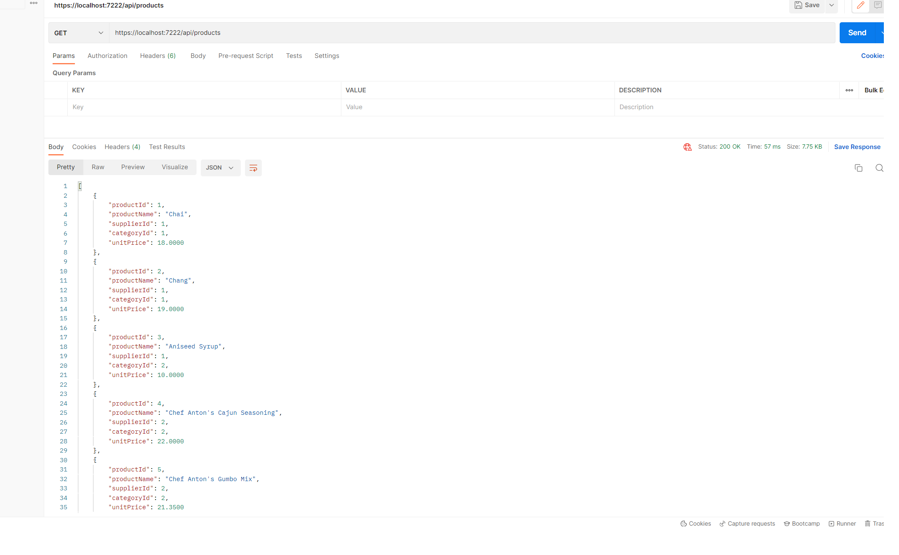
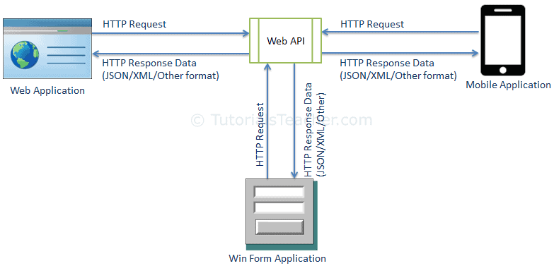

# Northwind_API_Project 
[](https://coveralls.io/github/RRP1602/Northwind_API_Project?branch=ci)

## Table Of Contents

1. [About The Project](#about-the-project)
2. [Getting Started](#getting-started)  
    1. [How to Use](#how-to-use)
3. [Endpoints](#end-points)
3. [Web API](#web-api)
4. [Contributors](#contributors) 

# About the Project
We have created a web API using the northwind database. Our project allows the user to manipulate data within the products table within the database. The user can get products using the "ProductId", "CategoryId", "SupplierId" or the "Product Name". They can also add, delete and edit the products. They can view the products using many different filters such as the most popular products. We used the Northwind database to get he products used for this API project. We used ``` scaffold dbcontext ``` to get all the data from the databse.

# Built With
 This application is built using .Net 6 and C#.

---
# Getting Started 
Clone the repo 
```
https://github.com/RRP1602/Northwind_API_Project.git 
```

- We recommend having the latest Visual Studio installed as well as C#.


# Web API
A Web API is an application programming interface for the Web. A web API can be made using .Net or Java and this project we have used .Net. 


# How to use
- We recommend having the latest Visual Studio installed as well as C#. 
- You can use the swagger UI but having Postman is a much better option. 
- Once the repo has been cloned open the ``` NorthwindAPI.sln``` file. 
- Run the code and use the URL you get and copy and paste it into Postman. 


Above is an example of how it looks when all the products are selected on Postman. 

# End Points 
- We have multiple different end points depending on what command is. 
- For getting products SupplierId the end point is ``` GET: api/Products/ByCategory/1 ``` 
- For deleting a product the endpoint will be ``` DELETE: api/Products/5 ``` 
- You can find the endpoints for other methods right above the method.

# Web API
A Web API is an application programming interface for the Web. A web API can be made using .Net or Java. A web API is very useful as it allows GET, POST and many more requests to be used via an interface. This interface can be used for a variety of requests via the Internet.

Above is a visual representation of how a Web API works. 

# Contributors 
- Lewis James Kellet(Scrum Master)
- Mark Pollard
- Nath Bird
- Cesar Mello
- Rahul Patel
